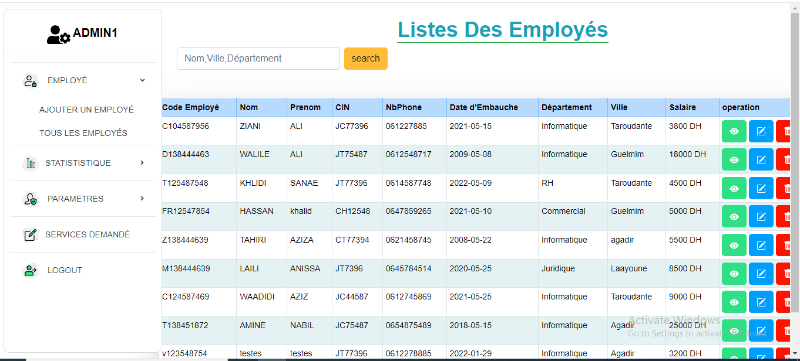
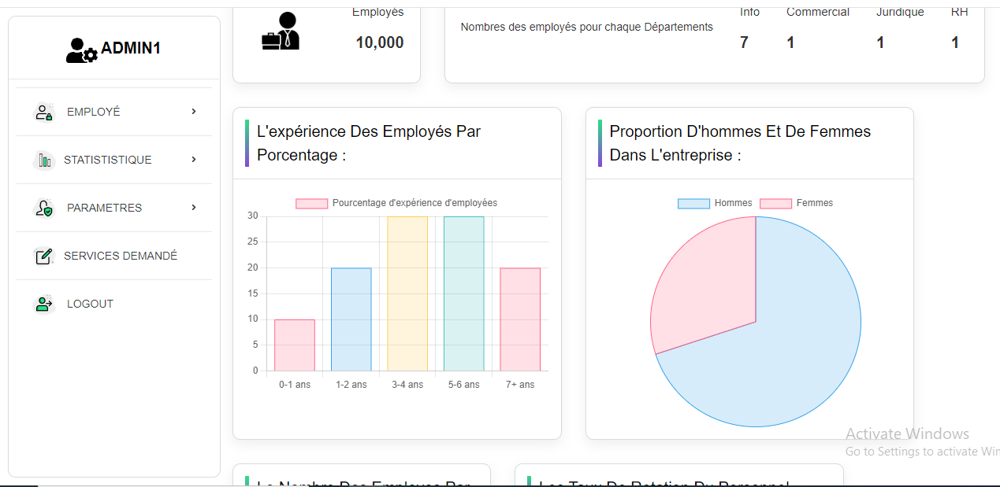
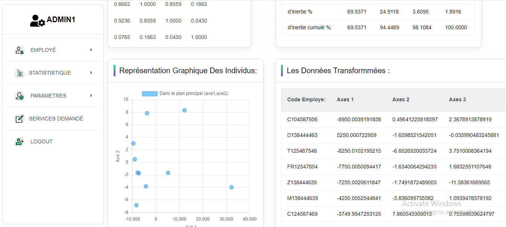

<h1>Gestion des Employés - Application Laravel</h1>
    
Ce projet est une application web de gestion des employés développée avec le framework Laravel. Elle permet aux administrateurs de gérer facilement les informations des employés, d'analyser les statistiques relatives au personnel, et de visualiser les données à travers des graphiques intuitifs.

<h2>Fonctionnalités Principales</h2>
<ul>
        <li><strong>Gestion des Employés</strong> : Ajouter, modifier, visualiser, et supprimer les informations des employés, y compris leurs détails personnels, département, ville, et salaire.</li>
        <li><strong>Statistiques et Analyses</strong> : Générer des statistiques détaillées sur l'expérience des employés, la répartition hommes/femmes, et la distribution des employés par département.</li>
        <li><strong>Analyse en Composantes Principales (ACP)</strong> : Utilisation de l'ACP pour la réduction dimensionnelle et l'analyse avancée des données des employés, facilitant la visualisation des relations entre différents critères.</li>
        <li><strong>Visualisation des Données</strong> : Affichage de graphiques dynamiques et interactifs pour une meilleure compréhension des données.</li>
        <li><strong>Recherche Avancée</strong> : Fonctionnalité de recherche pour filtrer les employés par nom, ville, ou département.</li>
    </ul>

<h2>Technologies Utilisées</h2>
    <ul>
        <li><strong>Backend</strong> : Laravel 8.x</li>
        <li><strong>Frontend</strong> : Bootstrap</li>
        <li><strong>Base de Données</strong> : MySQL</li>
        <li><strong>Graphiques</strong> : Chart.js</li>
        <li><strong>Analyse de Données</strong> : Analyse en Composantes Principales (ACP)</li>
    </ul>

<h2>Installation</h2>
    <ol>
        <li>Clonez le dépôt : <code>git clone https://github.com/votre-utilisateur/votre-repo.git</code></li>
        <li>Installez les dépendances : <code>composer install</code></li>
        <li>Configurez la base de données dans <code>.env</code></li>
        <li>Exécutez les migrations : <code>php artisan migrate</code></li>
        <li>Lancez le serveur local : <code>php artisan serve</code></li>
    </ol>

The Laravel framework is open-sourced software licensed under the [MIT license](https://opensource.org/licenses/MIT).

## Captures d'écran

